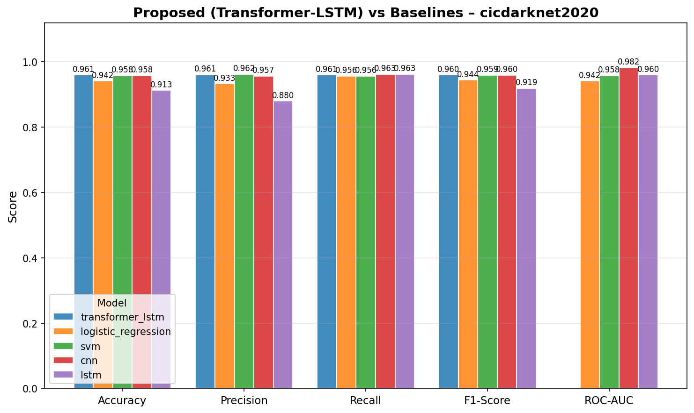
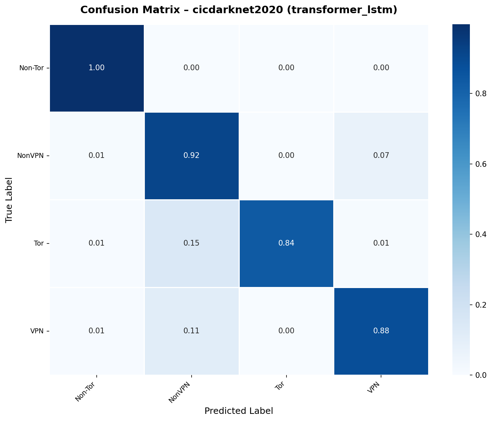
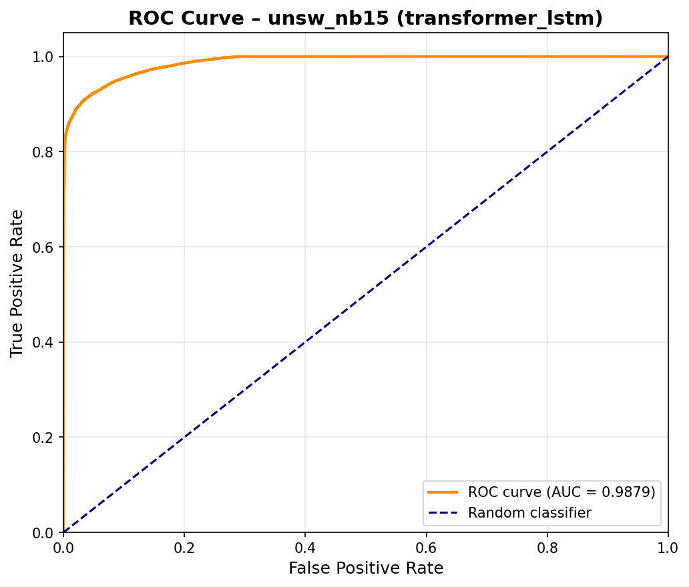
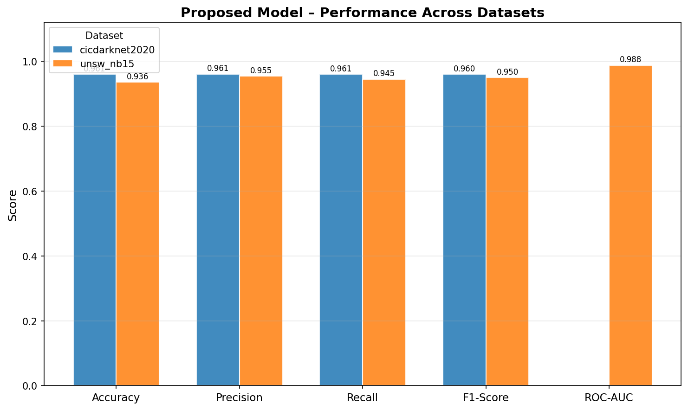

# An Attention-Based LSTM Model for Intelligent Network Traffic Classification

> **Transformer-Enhanced LSTM for network traffic classification**  
> Built with TensorFlow/Keras · Evaluated on CIC-Darknet2020 and UNSW-NB15 · Benchmarked against traditional models

[](https://www.python.org/)
[](https://www.tensorflow.org/)
[](LICENSE)

---

## Paper

**"An Attention-Based LSTM Model for Intelligent Network Traffic Classification"**  
Nazinda, Zunaira Sabir, Aazain Jan  
Department of Software Engineering, BUITEMS, Quetta, Pakistan

> The full paper is available in [`report/`](report/).

---

## Overview

This repository contains the complete implementation for our paper on hybrid deep learning for network traffic classification. We propose a **Transformer-Enhanced LSTM** architecture that applies multi-head self-attention on top of LSTM outputs, enabling the model to focus on critical temporal patterns in network flow statistics.

The model is evaluated on two public benchmark datasets and compared the CICDARKNET2020 dataset against traditional models across all standard metrics.

---

## Architecture

**Proposed model — Transformer-Enhanced LSTM** (`model_type=transformer_lstm`):

```
Input (samples, timesteps=1, features)
  → LSTM (128 units, return_sequences=True)
  → MultiHeadAttention (4 heads, key_dim=32)
  → Residual Add + LayerNormalization
  → GlobalAveragePooling1D
  → Dropout(0.3) → Dense(128, ReLU) → Dropout(0.3)
  → Output: Dense(1, sigmoid) [binary] | Dense(N, softmax) [multi-class]
```
---

## Results

### Proposed vs. Baseline

| Dataset | Model | Accuracy | Precision | Recall | F1-Score | ROC-AUC |
|---------|-------|----------|-----------|--------|----------|---------|
| CIC-Darknet2020 | **Transformer-LSTM (Proposed)** | **96.05%** | **96.06%** | **96.05%** | **96.04%** | — |
| CIC-Darknet2020 | Logistic-Regression | 94.19% | 93.29% | 95.63% | 94.44% | 94.15% |
| CIC-Darknet2020 | SVM | 95.81% | 96.23% | 95.63% | 95.92% | 95.81% |
| CIC-Darknet2020 | CNN | 95.81% | 95.65% | 96.25% | 95.95% | 98.24% |
| CIC-Darknet2020 | LSTM | 91.29% | 88.00% | 96.25% | 91.94% | 96.04% |


### Performance Comparison — CIC-Darknet2020




### Confusion Matrix — Transformer-LSTM on CIC-Darknet2020



### ROC Curve — Transformer-LSTM on UNSW-NB15



### Cross-Dataset Comparison (Proposed Model)



---

## Datasets

| # | Dataset | File | Task | Classes | Samples |
|---|---------|------|------|---------|---------|
| 1 | [CIC-Darknet2020](https://www.unb.ca/cic/datasets/darknet2020.html) | `dataset/cicdarknet2020.parquet` | Multi-class Tor/VPN classification | 4 | 103,121 |
| 2 | [UNSW-NB15](https://research.unsw.edu.au/projects/unsw-nb15-dataset) | `dataset/unsw_nb15.csv` | Binary attack detection | 2 | 257,673 |

See [`dataset/dataset_link.txt`](dataset/dataset_link.txt) for original source links.

**CIC-Darknet2020 classes:** Non-Tor · Non-VPN · Tor · VPN  
**UNSW-NB15 classes:** Normal · Attack

---

## Project Structure

```
.
├── README.md
├── requirements.txt
├── run_all.sh                        # Run full pipeline end-to-end
├── dataset/
│   ├── cicdarknet2020.parquet
│   ├── unsw_nb15.csv
│   └── dataset_link.txt
├── notebooks/
│   └── experiment.ipynb              # Interactive end-to-end walkthrough
├── src/
│   ├── preprocessing.py              # Load, clean, encode, scale, split
│   ├── model.py                      # Transformer-LSTM + Baseline-LSTM architectures
│   ├── train.py                      # CLI: train a model on a dataset
│   ├── evaluate.py                   # CLI: evaluate and save metrics + plots
│   ├── compare_results.py            # Baseline vs. proposed + cross-dataset comparison
│   └── utils.py                      # Logging, plotting, metrics I/O
├── results/
│   ├── <dataset>/<model>/            # metrics.json, evaluation_report.txt
│   └── comparison/                   # baseline_vs_proposed.csv/txt, dataset_comparison.csv/txt
├── figures/
│   ├── <dataset>/<model>/            # training_curves.png, confusion_matrix.png, roc_curve.png
│   └── comparison/                   # Bar chart comparisons
├── saved_models/
│   └── <dataset>/
│       ├── scaler.joblib
│       ├── label_encoder.joblib
│       ├── feature_encoders.joblib
│       └── <model>/best_model.keras
└── report/
    └── final_report.pdf
```

---

## Installation

```bash
git clone https://github.com/zuni-developer/An-Attention-Based-LSTM-Model-for-Intelligent-Network-Traffic-Classification.git
cd An-Attention-Based-LSTM-Model-for-Intelligent-Network-Traffic-Classification

python -m venv .venv
source .venv/bin/activate        # Windows: .venv\Scripts\activate
pip install -r requirements.txt
```

---

## Usage

### Run everything at once

```bash
bash run_all.sh
```

### Step-by-step

**1. Train**

```bash
# Proposed model
python src/train.py --dataset_path dataset/cicdarknet2020.parquet --dataset_name cicdarknet2020 --model_type transformer_lstm
python src/train.py --dataset_path dataset/unsw_nb15.csv           --dataset_name unsw_nb15      --model_type transformer_lstm
```

Optional flags: `--epochs 50 --batch_size 64 --lr 0.001`

**2. Evaluate**

```bash
python src/evaluate.py --dataset_path dataset/cicdarknet2020.parquet --dataset_name cicdarknet2020 --model_type transformer_lstm
python src/evaluate.py --dataset_path dataset/unsw_nb15.csv           --dataset_name unsw_nb15      --model_type transformer_lstm
```

Outputs saved to `results/<dataset>/<model>/` and `figures/<dataset>/<model>/`.

**3. Compare**

```bash
python src/compare_results.py
```

Produces comparison tables and bar charts in `results/comparison/` and `figures/comparison/`.

**4. Notebook**

```bash
jupyter notebook notebooks/experiment.ipynb
```

Edit the config cell at the top and run all cells for an interactive walkthrough.

---

## Preprocessing Pipeline

`src/preprocessing.py` implements the full pipeline applied identically to both datasets:

- Removes duplicate rows
- Replaces ±infinity with NaN; imputes using median (numeric) or mode (categorical)
- Auto-detects the target column; drops row-identifier and sibling target columns to prevent label leakage
- Label-encodes categorical features (protocol, service, state) — dropping these caused 8–12% accuracy loss in ablation experiments
- Standard-scales all numeric features
- Stratified 70/15/15 train/validation/test split (random seed 42)
- Reshapes to `(samples, timesteps=1, features)` for LSTM input
- Persists `scaler.joblib`, `label_encoder.joblib`, `feature_encoders.joblib` for reproducible evaluation

---

## Hyperparameters

| Parameter | Value |
|-----------|-------|
| Epochs | 50 (early stopping patience = 10) |
| Batch size | 64 |
| Learning rate | 1 × 10⁻³ (Adam) |
| LSTM units (proposed) | 128 |
| Attention heads | 4 |
| Key dimension | 32 |
| Dropout rate | 0.3 |
| Random seed | 42 |

---

## Software Dependencies

| Package | Version |
|---------|---------|
| TensorFlow | 2.15+ |
| scikit-learn | 1.3+ |
| pandas | 2.0+ |
| numpy | 1.24+ |
| matplotlib | 3.7+ |
| seaborn | 0.12+ |
| joblib | 1.3+ |

---

## Team

| Name | Roll No | Contribution |
|------|---------|--------------|
| Nazinda | 63810 | Code, GitHub repository |
| Zunaira Sabir | 62717 | Report writing, presentation slides |
| Aazain Jan | 63219 | Report writing, presentation |

---

## Citation

If you use this code or build on this work, please cite:

```bibtex
@article{nazinda2026attentionlstm,
  title     = {An Attention-Based LSTM Model for Intelligent Network Traffic Classification},
  author    = {Nazinda, Zunaira Sabir, and Aazain Jan},
  year      = {2026},
  institution = {Department of Software Engineering, BUITEMS, Quetta, Pakistan},
  url       = {https://github.com/zuni-developer/An-Attention-Based-LSTM-Model-for-Intelligent-Network-Traffic-Classification}
}
```

---

## References

1. A. Azab et al., "Network traffic classification: Techniques, datasets, and challenges," *Digital Communications and Networks*, vol. 10, pp. 676–692, 2024.
2. F. Pacheco et al., "Towards the deployment of machine learning solutions in network traffic classification: A systematic survey," *IEEE Communications Surveys & Tutorials*, vol. 21, no. 2, pp. 1988–2014, 2019.
3. J. Zhang et al., "Robust network traffic classification," *IEEE/ACM Transactions on Networking*, vol. 23, no. 4, pp. 1257–1270, 2015.
4. N. Mandela et al., "Efficient dark web traffic classification using a hybrid CNN-LSTM model," *International Journal of Information Technology*, 2025.
5. A. H. Lashkari et al., "CIC-Darknet2020 dataset," University of New Brunswick, 2020.
6. N. Moustafa and J. Slay, "UNSW-NB15: A comprehensive data set for network intrusion detection systems," *MilCIS*, 2015.
